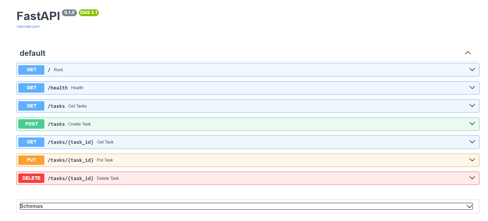

# Task API

This is a CRUD based application that allows one to do GET, POST, PUT and DELETE. Since I've used FastAPI, there also a Swagger UI which would help you understand how the CRUD works through the server side.

## How to run it

```bash
git clone https://github.com/mvdnyt/todo-api.git
cd todo-api
python -m venv venv
venv\Scripts\activate
pip install -r requirements.txt
uvicorn main:app --reload --port 8000
```

Then visit http://localhost:8000/docs for interactive Swagger UI.

## Endpoints

| Method | Path | Description |
|---|---|---|
| GET | / | Tells you about the main API |
| GET | /health | Checks if the server is currently running |
| GET | /tasks | Return all tasks |
| GET | /tasks/{task_id} | Return a single task by id or return 404 error if it doesn't exist |
| POST | /tasks | Create a new task from title and add it to the list |
| PUT | /tasks/{task_id} | Update a tasks title and/or done status |
| DELETE | /tasks/{task_id} | Delete a task by id |

## Example request

```bash
HTTP/1.1 200 OK
date: Wed, 15 Jul 2026 08:16:46 GMT
server: uvicorn
content-length: 39
content-type: application/json

{"id":1,"title":"Buy milk","done":true}
```

## Swagger UI


